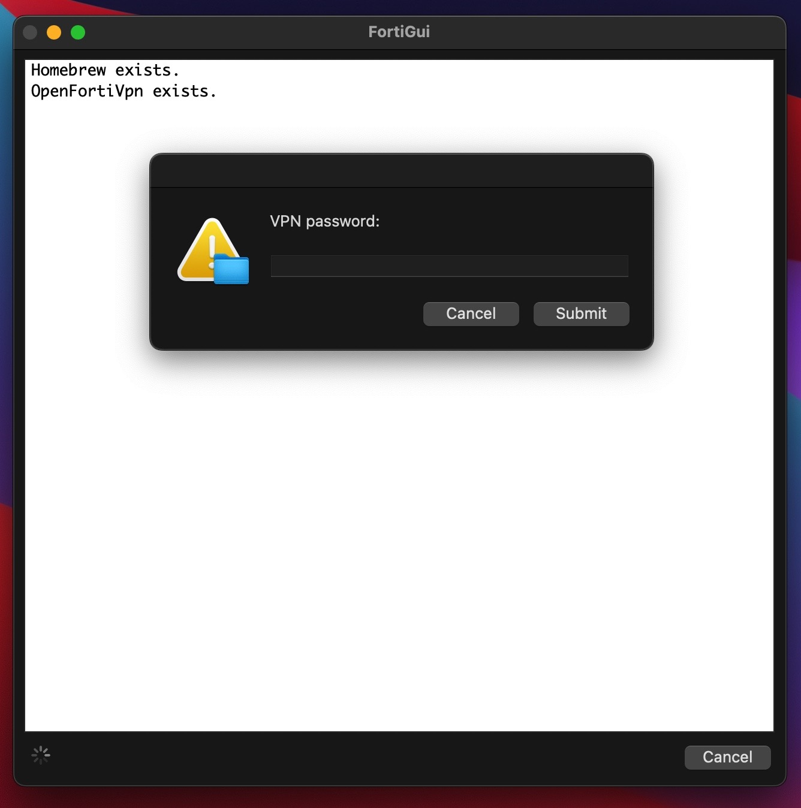
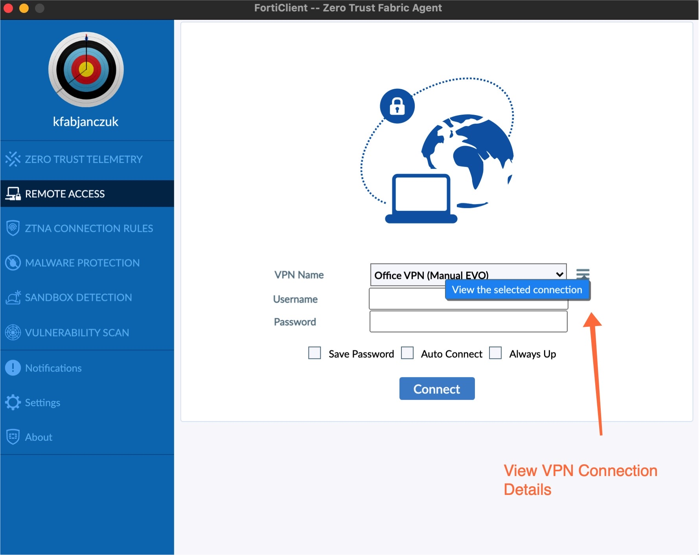
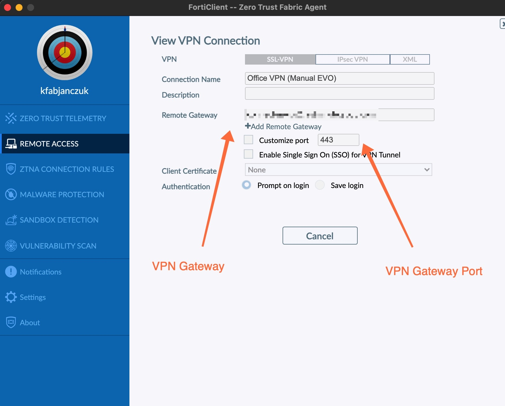
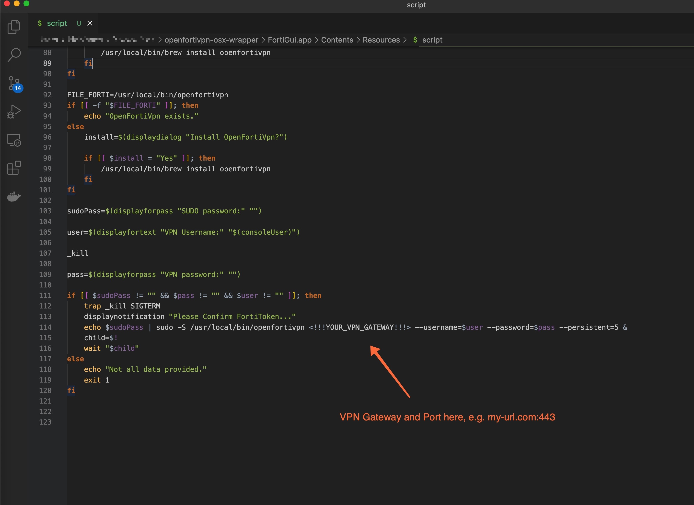
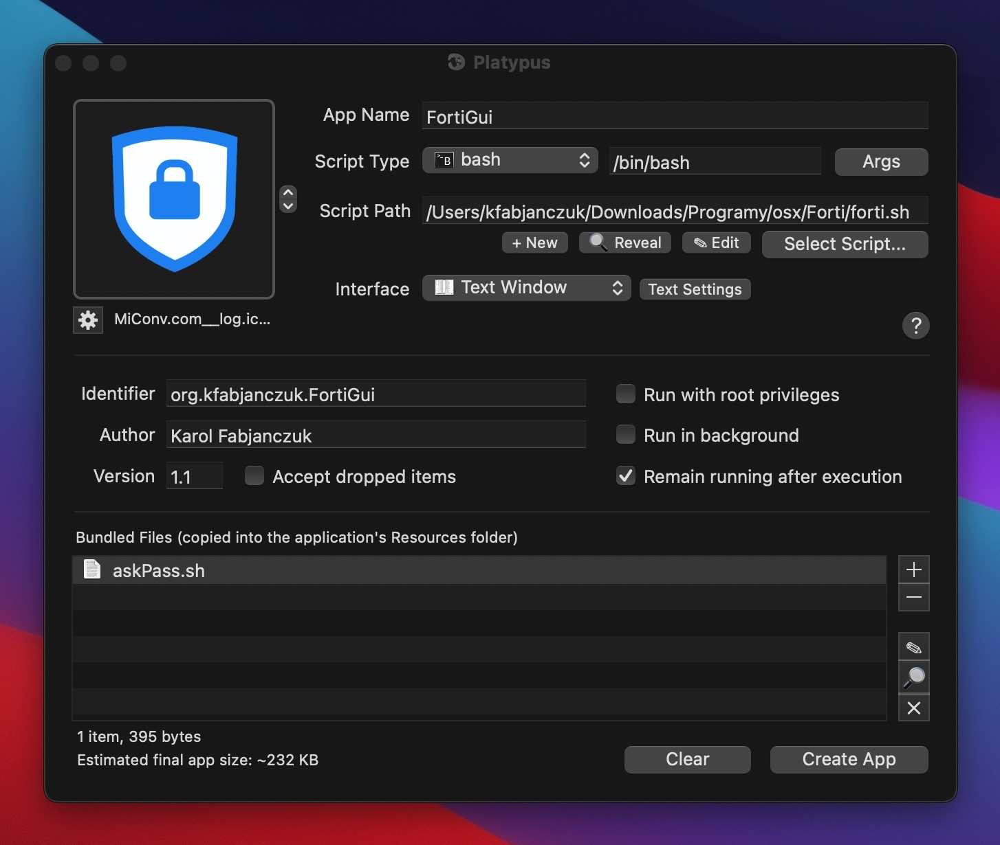

   
  

<h3 align="center">FortiVpnGui</h3>

  

    GUI for OpenFortiVpn CLI
  

### Built With

- [Platypus](https://github.com/sveinbjornt/Platypus/)
- [openfortivpn](https://formulae.brew.sh/formula/openfortivpn)

## Installation

### Download
Download [OpenFortiGui.app](./FortiGui.app.zip) ZIP and unpack it.

### Check your VPN Gateway and Port

First you have to check your existing Forti connection details

Then check Gateway and Port

And put that data into downloaded `FortiGui.app/Contents/Resources/script` file

After saving, you can move `FortiGui.app` to your OSX application folder and run it.

In the first run it will need Homebrew and openfortivpn installed but it will auto install it for you (if not please install it manually).

## How it's built

    

It's a shell wrapper around openfortivpn CLI. [You can see script here](./FortiGui.app/Contents/Resources/script).

